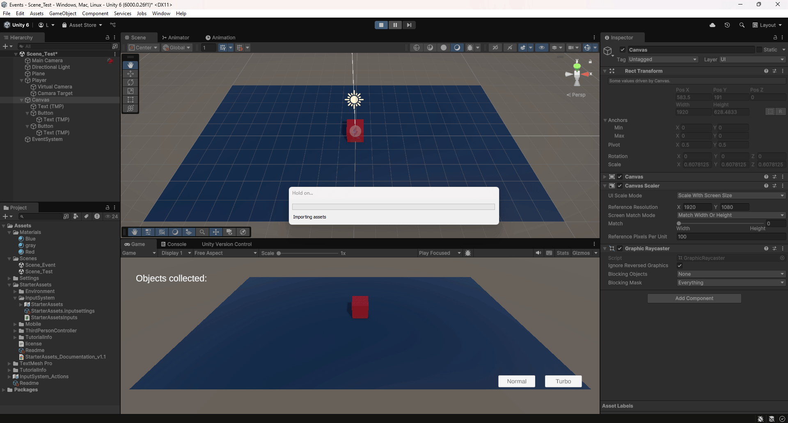
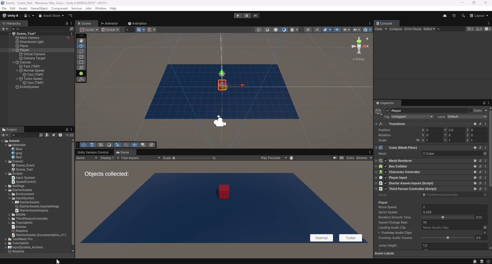

# FDV_EVENTOS

```
>>  PRACTICA:   Unity Project - Eventos
>>  COMPONENTE: XueMei Lin
>>  GITHUB:     https://github.com/XueMei-L/FDV_Events.git
```

### En esta actividad realizaremos pruebas con las diferentes modalidades de uso de eventos para enviar mensajes entre los objetos de la escena en Unity.

### En Unity se pueden definir:

* Eventos de la UI
* Eventos del sistema de eventos soportados
* Nuestros propios eventos:
* * Delegados, eventos C# - Patrón observador.

### Actividades a realizar:

### 1. Implementar una UI que permita configurar con qué velocidad te moverás: turbo o normal. También debe mostar la cantidad de objetos recolectados y si chocas con alguno especial restar fuerza.
1. Crear un plano
2. Crear un cubo como "personaje"
3. Aplicar cinemachine y un objeto vacio llamado "Camara Target" al cubo.
4. Además aplicar los scripts de StartAsset para el cubo: **Player Input**, **Start Assets Inputs**, **Third Person Controller**
5. Asignar Virtual Camara, donde Follow y Look At a **Camara Target**, y en la configuración del **Third Person Controller** donde **cinemachine Camara Target** -> asignar **Camara Target**
6. Crar un objeto **Canvas**, añadir **UI -> Button** para controlar la velocidad si es normal o turbo. Y otro texto para notar el número de objetos recolectados.
7. ***Resultado:*** para conseguir que se mueve el "personaje"

8. Crear un script para mostrar el ratón, para mostrar el ratón en la ventana **GAME**, se puede crear un **Input System**
9. Modificar color de botones cuando sea seleccionado
10. ***Resultado:***: se puede ver en la consola, cuando se selecciona botón de normal o de turbo, y la velocidad del personaje se cambia.


### 2. Agrega un personaje que al clickar sobre un botón de la UI se dirija hacia un objetivo estático en la escena.


### 3. Agregar a tu escena un objeto que al ser recolectado por el jugador haga que otros dos objetos en la escena realicen las siguientes acciones: el objeto A se desplaza hacia el jugador. El objeto B se ubica en un punto fijo en la escena.